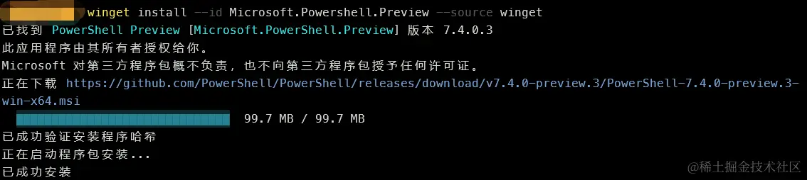
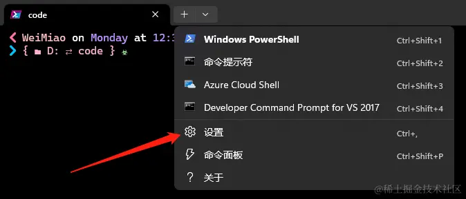
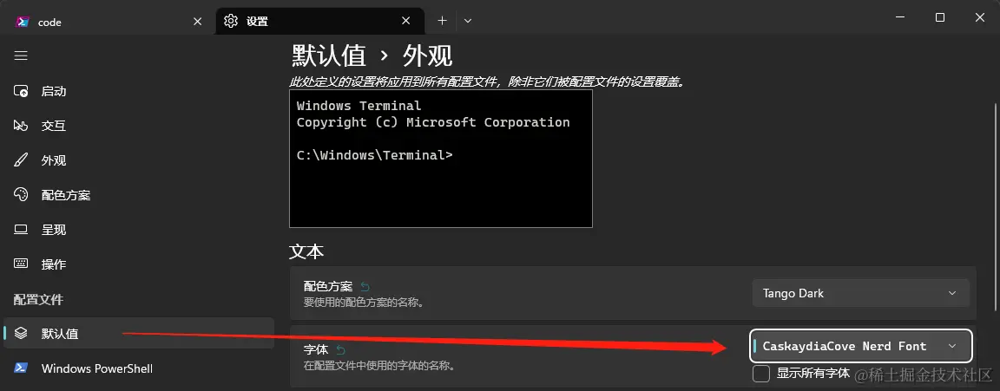

# windows 终端

## 终端工具美化

### 安装 [powershell](https://learn.microsoft.com/zh-cn/powershell/scripting/install/installing-powershell-on-windows?view=powershell-7.3)

- 官方推荐使用 Winget 安装

搜索最新版本的 PowerShell

```bash
winget search Microsoft.PowerShell
```

输出下面内容

```bash
Name               Id                           Version Source
--------------------------------------------------------------
PowerShell         Microsoft.PowerShell         7.3.4.0 winget
PowerShell Preview Microsoft.PowerShell.Preview 7.4.1.0 winget
```

使用 id 安装指定版本

```bash
winget install --id Microsoft.Powershell.Preview --source winget
```

安装成功


### 使用 oh My Posh

打开 powershell，安装 oh My Posh

```bash
winget install JanDeDobbeleer.OhMyPosh -s winget
```

修改一下 oh My Posh 的配置文件

```bash
# 打开配置文件
notepad $PROFILE

# 在配置文件中添加配置并保存
oh-my-posh init pwsh | Invoke-Expression

# 重新载入配置文件
. $PROFILE

# 这时候 oh My Posh 默认主题就生效了
```

oh My Posh 的配置文件目录

```bash
C:\Users\<username>\Documents\PowerShell\Microsoft.PowerShell_profile.ps1
```

安装字体

现在主题虽然生效了，但是图标都出不来，因为 Oh My Posh 使用的是 Nerd 字体，如果不用 Nerd 字体，会导致图标出不来，下面链接里全是 Nerd 字体，可以选择自己喜欢的款式安装，选择字体：
[https://www.nerdfonts.com/font-downloads](https://www.nerdfonts.com/font-downloads)

设置 powershell 字体

点击 powershell 头部下拉箭头，设置 -> 默认值 -> 外观 -> 字体，选择刚才安装的 Nerd 字体，点击保存




### 修改主题

本地 oh My Posh 的主题都存放在这个目录（等会修改配置文件时要用）：

```bash
C:\Users\<username>\AppData\Local\Programs\oh-my-posh\themes
```

oh My Posh 官方提供了很多主题，可以在这里查看：[ohmyposh.dev/docs/themes](https://ohmyposh.dev/docs/themes)

选择自己喜欢的主题，然后修改 powershell 配置文件：

```bash
# 我使用的是 1_shell 主题
oh-my-posh init pwsh --config 'C:\Users\<username>\AppData\Local\Programs\oh-my-posh\themes\1_shell.omp.json' | Invoke-Expression
```

保存后重新加载配置文件，命令行输入：. $PROFILE，主题就生效了

```bash
. \$PROFILE
```

### 修改 powershell 启动时打开的目录

打开 powershell 配置文件，写入以下内容

```bash
set-location D:\code
```

保存后重新加载配置文件，命令行输入：. $PROFILE，重新打开 powershell 就可以看到效果了
